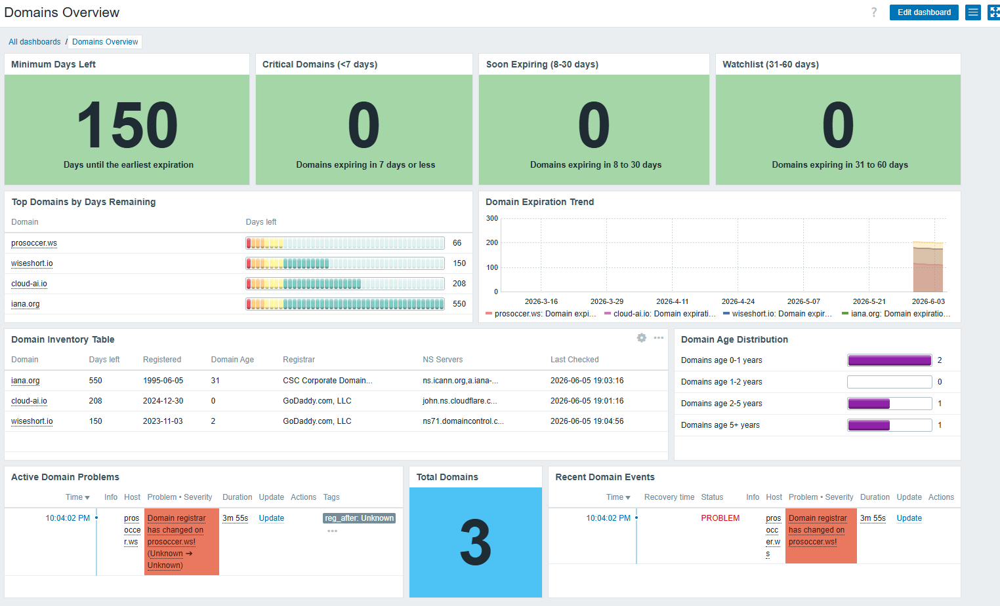
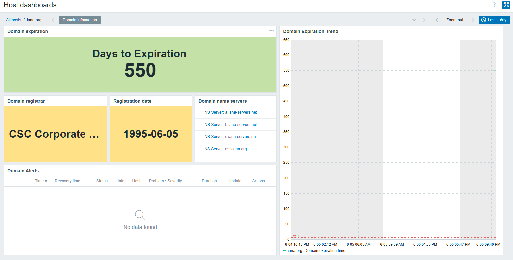

# Zabbix Domain Monitoring


A reusable Zabbix 7.4 template set for monitoring domain expiration, WHOIS metadata, name servers, and high-level domain portfolio health.

The project is designed around two templates:

1. **Domain Checks** — attached to every monitored domain host.
2. **Domain Overview** — attached to one technical overview host and used for dashboard aggregates.

The goal is to keep Zabbix responsible for monitoring, alerting, and operational visibility, while avoiding manual per-domain dashboard work.

`Domain Overview` is optional, but recommended if you want portfolio-level dashboard widgets and aggregate counters.

---

## What this solves

Domain expiration incidents are easy to miss when domains are managed across different registrars, accounts, and DNS providers.
This project provides a reusable Zabbix-based monitoring setup for tracking domain expiration dates, WHOIS metadata, registrars, name servers, and portfolio-level risk indicators.

## Project status

This project is currently under active development.
The core domain expiration monitoring and overview dashboard structure are available. Some optional features, such as exact expiration date parsing, are planned. Domain age distribution is available but depends on WHOIS creation date parsing and may be inaccurate for some TLDs.

## Current limitations

- WHOIS output differs between TLDs and registrars, so some domains may require parser adjustments.
- Registrar distribution pie charts are not generated automatically in native Zabbix because Zabbix does not provide a simple `GROUP BY` aggregation for text item values.
- Domain age distribution is available, but depends on WHOIS creation date parsing and may be inaccurate for some TLDs.
- The project currently focuses on Zabbix dashboards; Grafana dashboards may be added later.

## Screenshots

### Domain Infrastructure Overview



### Domain Host Dashboard



## Features

### Per-domain monitoring

- Days until domain expiration
- Domain registration date
- Registrar name
- Last check timestamp
- Name servers
- Name server discovery
- Per-name-server DNS query status
- Expiration trend graph
- Domain-specific host dashboard

### Portfolio overview

- Minimum days left across all monitored domains
- Count of critical domains: `<= 7 days`
- Count of soon expiring domains: `8–30 days`
- Count of watchlist domains: `31–60 days`
- Top domains by days remaining
- Domain inventory table
- Active domain problems
- Name server change detection
- Domain age distribution

---

## Tested with

- Zabbix Server 7.4
- Zabbix Agent 2
- Linux host with `whois` and `dig` installed
- Bash script executed through a Zabbix `UserParameter`

---

## Repository structure

```text
zabbix-domain-monitoring/
├── README.md
├── scripts/
│   └── check_domain.sh
├── templates/
│   ├── template_domain_checks.yaml
│   └── template_domain_overview.yaml
├── docs/
│   ├── dashboard-overview.png
│   └── host-dashboard.png
```

---

## Requirements

Install `whois` on the host where the Zabbix agent runs the script.

### Ubuntu / Debian

```bash
sudo apt update
sudo apt install whois dnsutils
```

### RHEL / CentOS / Rocky / AlmaLinux

```bash
sudo dnf install whois bind-utils
```

---

## Installation

### 1. Copy the script

Copy the script to a directory accessible by the Zabbix agent.

Example:

```bash
sudo mkdir -p /usr/lib/zabbix/externalscripts
sudo cp scripts/check_domain.sh /usr/lib/zabbix/externalscripts/check_domain.sh
sudo chmod +x /usr/lib/zabbix/externalscripts/check_domain.sh
```

Test manually:

```bash
/usr/lib/zabbix/externalscripts/check_domain.sh example.com expiry
/usr/lib/zabbix/externalscripts/check_domain.sh example.com registrar
/usr/lib/zabbix/externalscripts/check_domain.sh example.com ns
/usr/lib/zabbix/externalscripts/check_domain.sh example.com ns_discovery
/usr/lib/zabbix/externalscripts/check_domain.sh example.com ns_query a.iana-servers.net
```

---

### 2. Configure Zabbix Agent 2

Add a `UserParameter`.

Create a file:
```bash
sudo nano /etc/zabbix/zabbix_agent2.d/domain_checks.conf
```

For example:

```text
UserParameter=check_domain[*],/usr/lib/zabbix/externalscripts/check_domain.sh "$1" "$2" "$3"
```

Restart the Zabbix agent:

```bash
sudo systemctl restart zabbix-agent2
```

Test from the Zabbix server:

```bash
zabbix_get -s <agent_ip> -k 'check_domain["example.com",expiry]'
```

Expected output:

```text
114
```

---

## Zabbix setup

### 1. Create a host group

Create a host group for domain hosts.

Default name used by the overview template:

```text
Domain
```

You may use another name, but then update the macro `{$DOMAIN_GROUP}` in `Domain Overview`.

---

### 2. Import templates

Import the templates:

```text
templates/template_domain_checks.yaml
templates/template_domain_overview.yaml
```

---

### 3. Create domain hosts

Create one Zabbix host per domain.

Example:

```text
Host name: example.com
Groups: Domain
Templates: Domain Checks
```

Set the host macro:

```text
{$DOMAINNAME}=example.com
```

Repeat for every monitored domain.

Example:

```text
example.com
example.org
example.net
```

---

### 4. Create the overview host

Create one technical host for portfolio-level aggregate metrics.

Example:

```text
Host name: Domain Overview
Visible name: Domain Overview
Templates: Domain Overview
```

This host does not need an agent interface if it only contains calculated items. If your Zabbix version requires an interface during host creation, add any placeholder agent interface; it will not be used by calculated items.

Set or verify the macro:

```text
{$DOMAIN_GROUP}=Domain
```

---

## Items

### Domain Checks

| Item | Type | Key | Value type |
|---|---|---|---|
| Domain expiration time | Zabbix agent | `check_domain["{$DOMAINNAME}",expiry]` | Numeric unsigned |
| Domain registration date | Zabbix agent | `check_domain["{$DOMAINNAME}",created]` | Text |
| Domain registrar | Zabbix agent | `check_domain["{$DOMAINNAME}",registrar]` | CHAR |
| Domain name servers | Zabbix agent | `check_domain["{$DOMAINNAME}",ns]` | Text |
| Domain last checked | Zabbix agent | `check_domain["{$DOMAINNAME}",checked]` | Text |
| Discover NS servers | Zabbix agent discovery | `check_domain["{$DOMAINNAME}","ns_discovery"]` | LLD |
| Domain age years | Zabbix agent | `check_domain["{$DOMAINNAME}",age_years]` | Numeric unsigned |

LLD item prototypes:

| Item prototype | Type | Key | Value type |
|---|---|---|---|
| NS server {#NS_SERVER} DNS query status | Zabbix agent | `check_domain["{$DOMAINNAME}","ns_query","{#NS_SERVER}"]` | Numeric unsigned |

The `ns_query` item prototype returns `1` if the discovered name server returns a DNS SOA answer for the monitored domain, and `0` otherwise.

Optional future items:

| Item | Type | Key | Value type |
|---|---|---|---|
| Domain expiration date | Zabbix agent | `check_domain["{$DOMAINNAME}",expiry_date]` | Text |
| Domain NS count | Zabbix agent | `check_domain["{$DOMAINNAME}",ns_count]` | Numeric unsigned |

---

## Triggers

Recommended expiration severity model:

| Range | Severity | Expression |
|---|---|---|
| 31–60 days | Average | `last(/Domain Checks/check_domain["{$DOMAINNAME}",expiry])<=60 and last(/Domain Checks/check_domain["{$DOMAINNAME}",expiry])>30` |
| 8–30 days | High | `last(/Domain Checks/check_domain["{$DOMAINNAME}",expiry])<=30 and last(/Domain Checks/check_domain["{$DOMAINNAME}",expiry])>7` |
| 0–7 days | Disaster | `last(/Domain Checks/check_domain["{$DOMAINNAME}",expiry])<=7` |

The `/Domain Checks/` part in trigger expressions must match the actual template or host name used in your Zabbix setup.

Recommended trigger names:

```text
Domain name {$DOMAINNAME} will expire in 31-60 days
Domain name {$DOMAINNAME} will expire in 8-30 days
Domain name {$DOMAINNAME} will expire in 7 days or less
```

---

## Overview calculated items

These items belong to `Domain Overview`.

### Minimum Days Left

```text
Name: Minimum Days Left
Key: domains.min.days_left
Type: Calculated
Formula:
min(last_foreach(/*/check_domain[*,expiry]?[group="{$DOMAIN_GROUP}"]))
```

### Critical Domains

Domains expiring in 7 days or less.

```text
Name: Critical Domains
Key: domains.critical.count
Type: Calculated
Formula:
count(last_foreach(/*/check_domain[*,expiry]?[group="{$DOMAIN_GROUP}"]),"le",7)
```

### Soon Expiring Domains

Domains expiring in 8–30 days.

```text
Name: Soon Expiring Domains
Key: domains.soon.count
Type: Calculated
Formula:
count(last_foreach(/*/check_domain[*,expiry]?[group="{$DOMAIN_GROUP}"]),"le",30)
-
count(last_foreach(/*/check_domain[*,expiry]?[group="{$DOMAIN_GROUP}"]),"le",7)
```

### Watchlist Domains

Domains expiring in 31–60 days.

```text
Name: Watchlist Domains
Key: domains.watchlist.count
Type: Calculated
Formula:
count(last_foreach(/*/check_domain[*,expiry]?[group="{$DOMAIN_GROUP}"]),"le",60)
-
count(last_foreach(/*/check_domain[*,expiry]?[group="{$DOMAIN_GROUP}"]),"le",30)
```

### Total Domains

```text
Name: Total Domains
Key: domains.total.count
Type: Calculated
Formula:
count(last_foreach(/*/check_domain[*,expiry]?[group="{$DOMAIN_GROUP}"]))
```

---

## Dashboard layout

Recommended dashboard name:

```text
Domain Infrastructure Overview
```

### Row 1: KPI cards

Use `Item value` widgets:

```text
Minimum Days Left
Critical Domains
Soon Expiring Domains
Watchlist Domains
```

Recommended thresholds for `Minimum Days Left`:

| Threshold | Color |
|---:|---|
| 0 | Red |
| 8 | Orange |
| 31 | Yellow |
| 61 | Green |

Recommended thresholds for count widgets:

| Threshold | Color |
|---:|---|
| 0 | Green |
| 1 | Red / Orange / Yellow depending on widget |

---

### Row 2: Trends and ranking

#### Top Domains by Days Remaining

Use `Top hosts`.

Recommended columns:

```text
Domain
Days Left
```

Recommended settings:

```text
Host patterns: *
Item name: Domain expiration time
Sort: Days Left ascending
```

#### Domain Expiration Trend

Use `Graph`.

Recommended settings:

```text
Host patterns: *
Item patterns: Domain expiration time
Time period: Last 30 days or Last 90 days
Draw: Line
```

---

### Row 3: Domain inventory

Use `Top hosts`.

Recommended columns:

```text
Domain
Days left
Registered
Registrar
NS Servers
Last Checked
```

Optional future columns:

```text
Expiration Date
Domain Age
NS Count
```

---

### Row 4: Operational events

#### Active Domain Problems

Use `Problems`.

Recommended filters:

```text
Show: Problems
Host groups: Domain
Severity: Average, High, Disaster
```
---

## Notes about registrar distribution

Automatic pie chart grouping by registrar is not implemented natively in this template.

Zabbix can display registrar values in the inventory table, but it does not provide a simple built-in `GROUP BY registrar` pie chart from text item values.

Recommended options:

1. Use Grafana for automatic registrar distribution.
2. Create manual calculated counters per known registrar.
3. Extend the script with an external aggregation mode.

For a universal Zabbix-only template, the recommended default is to keep registrar information in the inventory table.

---

## Roadmap

Planned improvements:

- `expiry_date` mode for exact expiration date
- `ns_count` mode and trigger for domains with fewer than two name servers
- Improved NS change audit
- Optional Grafana dashboard
- Exported Zabbix YAML templates
- Example screenshots

---

## Security notes

- The script performs WHOIS lookups only and does not modify domain or DNS records.
- Do not store registrar credentials, API tokens, or domain account passwords in Zabbix macros.
- If you extend the project with registrar APIs, use protected macros or external secret management.
- Review script permissions and run it with the least privileges required.
- Be aware that frequent WHOIS queries may be rate-limited by registries or registrars.

---

## Contributing

Issues and pull requests are welcome.

Useful contributions include:

- Parser improvements for additional TLDs
- Zabbix template exports
- Dashboard screenshots
- Grafana dashboard examples
- Documentation improvements

---

## Troubleshooting

### Item returns `Error`

Check whether WHOIS output contains a recognizable expiration field.

Supported fields currently include:

```text
paid-till
expires
registry expiry date
expiration date
```

Some TLDs use non-standard WHOIS formats and may require parser adjustments.

### Calculated overview item is not supported

Check the host group macro:

```text
{$DOMAIN_GROUP}
```

It must match the exact Zabbix host group name containing the domain hosts.

If macro-based group filtering does not work in your Zabbix version, replace:

```text
[group="{$DOMAIN_GROUP}"]
```

with a literal group name:

```text
[group="Domain"]
```

### Graph is empty

Check the graph data set:

```text
Host patterns: *
Item patterns: Domain expiration time
```

Also use a longer period such as:

```text
Last 7 days
Last 30 days
Last 90 days
```

Domain checks often run once per day, so a one-day graph may show little or no data.

### WHOIS checks timeout

Some registries and registrars respond slowly. If items become unsupported with a timeout error, increase the item timeout override or the Zabbix agent timeout.

Recommended item timeout for WHOIS-based checks:

```text
10s–15s
```

---
## 📊 Project Stats


---
## License

This project is licensed under the MIT License. See [LICENSE](LICENSE) for details.
TL;DR: Free to use for personal and commercial projects. Attribution appreciated but not required.
